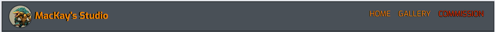
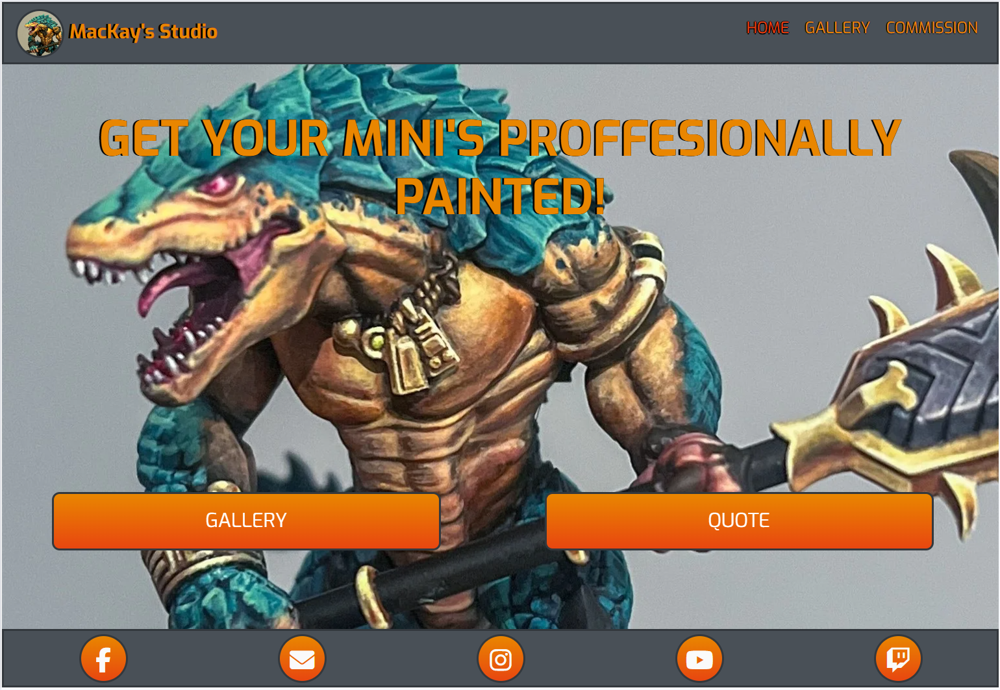
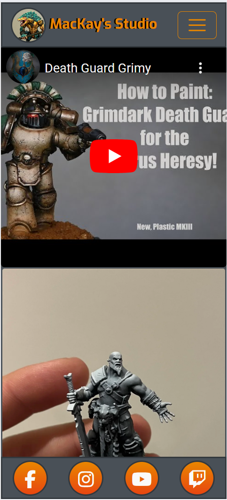
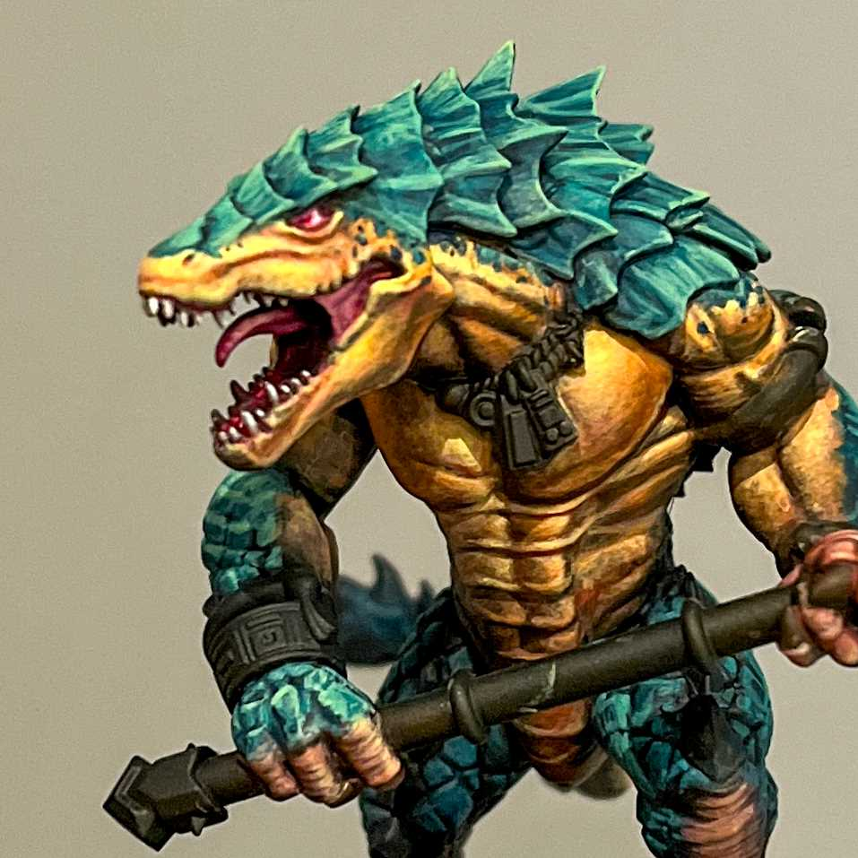
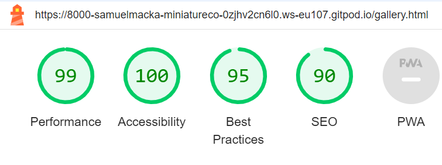
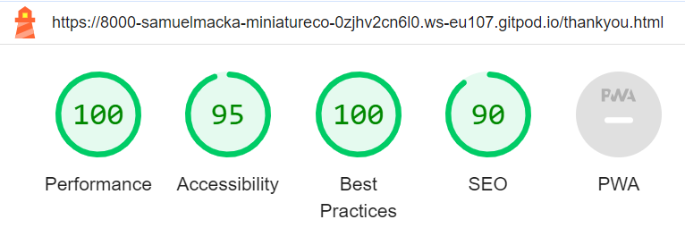

# MacKay's Painting Corner

MacKay's Painting Corner is a site for Table Top hobby enthusiasts who are interested in having their armies/miniatures painted for them, so they can get to playing the games faster and don't have to stress about learning the skills needed to become a high quality painter.
The site will have an easy to see gallery showcasing the painting standards and abilities of the artist, as well is quotes of other satisfied customers. as well as an easy to use way to get a quote for the site users own projects.


## User Stories 
|Story No.|Story|
| ------------- | ------------- |
|1| As a First-time User, <br> I want to be able to see examples of what the artist has created <br> so I can tell if they are worth the money and if I want to have my army look like that. <br><br> I know I am done when I have an easy to use gallery that shows all past commissions and artwork |
|2|As the artist, <br> I want anyone who goes to the website to be able to get the information they need easily <br> so that users are more likely to view my art and request a commission. <br><br> I know I am done when I have and inviting landing page with noticeable buttons for seeing the gallery and getting a quote for a commission.|
|3|As a Potential Buyer, <br> I want to be able to get in touch with the artist about my idea and quickly get a quote <br> So I can get an idea how much it will cost and how long it will take <br><br> I know I am done when I have a way to contact the artist, and easy to follow instructions to get the important information across to get an accurate quote.|
|4|As a First-time user,<br> I want to be able to find a community of like-minded people <br> so I can find people who share my interests. <br> <br> I know I am done users can quickly find social media links to the artists community, video tutorials and live streams.|
|5|As a new painter, <br> I want to be able to get tips on how to paint better <br> so that I can improve as a painter.<br> <br> I know I am done when users can find tutorials on the arists platorms. |

***

## Wireframes
Below are the designs that I can use to build the site. I have used the user story numbers to link where I can meet the goal in my design. This will help me to think about the users needs as I build the page.

### Home Page Design<br>
User Story Number - 2<br>


### Gallery Page Design<br>
User Story Number - 1, 5<br>


### Commission Page Design<br>
User Story Number - 3<br>


### Community contacts <br>
User Story Number - 4<br>


***

## Features

### Existing Features

- __Navigation Bar__

  - Featured on all three pages, the full responsive navigation bar includes links to the Home page, Gallery and Commission page and is identical in each page to allow for easy navigation.
  - This section will allow the user to easily navigate from page to page across all devices without having to revert back to the previous page via the ‘back’ button.
  - It will Collapse on smaller screen sizes to make it more managble and visually pleasing




- __The Footer__

  - The footer section includes links to the relevant social media sites for MacKay's Painting Corner. The links will open to a new tab to allow easy navigation for the user.
  - The footer is valuable to the user as it encourages them to keep connected via social media
  - The footer will use simple recognisable images to represent what they link to, for simplicity


- __Home page__

  - The home includes a hero image photograph of a painted army/mini with call to action buttons for getting your own commissions and seeing the gallery.
  - This section will have to very noticable Call to Action buttons to make it easy to understand what you can do and where you can go from here




- __Gallery__

  - The gallery will provide the user with supporting images to see what the artist is capable of.
  - This section is valuable to the user as they will be able to compare the artist to the industry standards and the exepectations of the viewer.
  - it will have embedded videos of tutorials from youtube, increasing exposure and community presence




- __Commissions__

  - This page will allow the user to get in touch with the artist for the booking a commission.
  - It will have a form that will be easy to fill out and give the artist enough information to form a general price quote.
  - Information such as What you want painted,(i.e army, unit or hero) a section for a breif description of any particulars they want (i.e any conversions, scheme/colour/theme, mini specifically) as well as a way to link a image for reference material.


### Features Left to Implement

- an about Artist Page.
- a tutorial specific page.
- a way to index the gallery, so it can be organised by commision/unit type, and can be filtered and searched.
- add quotes and images to the surrounding border of the commissions form, so people can see what others are saying about the service and get some ideas from other commissions.

## Testing

<!-- In this section, you need to convince the assessor that you have conducted enough testing to legitimately believe that the site works well. Essentially, in this part you will want to go over all of your project’s features and ensure that they all work as intended, with the project providing an easy and straightforward way for the users to achieve their goals.

In addition, you should mention in this section how your project looks and works on different browsers and screen sizes.

You should also mention in this section any interesting bugs or problems you discovered during your testing, even if you haven't addressed them yet.

If this section grows too long, you may want to split it off into a separate file and link to it from here.-->

### Validator Testing
- HTML
    - index.html: No errors were returned when passing through the official W3C validator<br> https://validator.w3.org/nu/?doc=https%3A%2F%2Fsamuelmackay.github.io%2Fminiature-commission-painter%2Findex.html

   - gallery.html: No errors were returned when passing through the official W3C validator<br> https://validator.w3.org/nu/?doc=https%3A%2F%2Fdlhamilton.github.io%2FLPSB-Learn-GCSE-CS%2Flessons.html

   - commission.html: No errors were returned when passing through the official W3C validator<br> https://validator.w3.org/nu/?doc=https%3A%2F%2Fdlhamilton.github.io%2FLPSB-Learn-GCSE-CS%2Fs_3_1.html

   - thankyou.html: No errors were returned when passing through the official W3C validator<br> https://validator.w3.org/nu/?doc=https%3A%2F%2Fsamuelmackay.github.io%2Fminiature-commission-painter%2Fthankyou.html

### Bugs
#### Bug 1
- The landing page image was not scaling as intended over all screen sizes, so i added new code and multiple images to load at correct screen sizes
Original code:
```
<picture class="hero-image">
                <source class="hero-image" media="(max-width:376px)" srcset="assets/images/mobile-landing-page-xsm.jpg">
                <source class="hero-image" media="(min-width:377px) and (max-width:426px)" srcset="assets/images/mobile-landing-page-sm.jpg">
                <source class="hero-image" media="(min-width:427px) and (max-width:768px)" srcset="assets/images/mobile-landing-page-med.jpg">
                <source class="hero-image" media="(min-width:768px)" srcset="assets/images/mobile-landing-page-lg.jpg">
                
              </picture>
```
New code:

```
<body id="landing-img">

style:
#landing-img {
  background-color: #495057;
  background-image: url('../images/mobile-landing-page-xsm.webp');
  background-repeat: no-repeat;
  background-position: center center; /* horizontal vertical */
  background-size: cover; /* or contain, depending on your needs */
}

@media (orientation: landscape) {
#landing-img {
  background-image: url('../images/mobile-landing-page-lg.webp');
  background-repeat: no-repeat;
  background-position: top center; /* horizontal vertical */
  background-size: cover; /* or contain, depending on your needs */
}
}
```

#### Bug 2 

- the footer was getting too crowded at smaller screen sizes, so I hid one of the least important icons at smaller screen sizes.
Original code:
```
<div class="col list-inline-item social-links">
                    <a href="https://www.gmail.com/" target="_blank">
                        <i class="fa fa-envelope" aria-hidden="true"></i>
                        <span class="sr-only">Email</span>
                    </a>
                </div>
```
New Code:
```
<div id="hidden-link" class="col list-inline-item social-links">
                    <a href="https://www.gmail.com/" target="_blank">
                        <i class="fa fa-envelope" aria-hidden="true"></i>
                        <span class="sr-only">Email</span>
                    </a>
                </div>
```
Style:
```
@media only screen and (max-width: 768px) {
  #hidden-link {
    display: none;
  }
}
```
#### Bug 3 
- The collapsed NavBar Toggler wasn't changing colour to match the theme of the website, so I discovered the correct way to edit the 'Hamburger Icon'.
Original Code:
```
.custom-toggler .navbar-toggler-icon {
  ackground-image: #e98600;
}
```
New Code:
```
.custom-toggler .navbar-toggler-icon {
  background-image: url("data:image/svg+xml;charset=utf8,%3Csvg viewBox='0 0 32 32' xmlns='http://www.w3.org/2000/svg'%3E%3Cpath stroke='rgba(233, 134, 0, 1)' stroke-width='2' stroke-linecap='round' stroke-miterlimit='10' d='M4 8h24M4 16h24M4 24h24'/%3E%3C/svg%3E");
}
```

#### Bug 4
- The Logo was not linking to the home page, as intended, and the Logo was not the correct 50px x 50px. fixed a typo in the code so it would work correctly and ajusted the inline style of the code.
Original Code:
```
<a class="navbar-brand" href="index.hmtl">
                    
                </a>
```
New Code:
```
<a class="navbar-brand" href="index.html">
                    
                </a>
```

#### Bug 5
- Performance of Gallery is heavily burdened by the high quality images.
- Fixed by converting all images from .jpg to .webp and correcting their sizes.

#### Bug 6
- Commissions page is breaking on shorter phone lengths and lanscape mode. can't scroll to see the lower part of the form.
- Added a height of 525px to the form element.
Original Code:
```
<form class="form-height" action="thankyou.html" method="#">
```
New Code:
```
<form class="form-height" action="thankyou.html" method="#">

style:
.form-height{
  height: 525px;
}

```

### Validator Testing
<!-->
- HTML
  - No errors were returned when passing through the official [W3C validator](https://validator.w3.org/nu/?doc=https%3A%2F%2Fcode-institute-org.github.io%2Flove-running-2.0%2Findex.html)
- CSS
  - No errors were found when passing through the official [(Jigsaw) validator](https://jigsaw.w3.org/css-validator/validator?uri=https%3A%2F%2Fvalidator.w3.org%2Fnu%2F%3Fdoc%3Dhttps%253A%252F%252Fcode-institute-org.github.io%252Flove-running-2.0%252Findex.html&profile=css3svg&usermedium=all&warning=1&vextwarning=&lang=en#css)-->

### Unfixed Bugs

-Commission Page is breaking at smaller screen heights. Cant see the lower half of the form and it won't scroll.

### User stories Testing
|Story No.|Result|Story/ Evidence|
| ------------- | ------------- | ------------- |
|1|<font color="green">Test Pass</font>|As a First-time User, <br> I want to be able to see examples of what the artist has created <br> so I can tell if they are worth the money and if I want to have my army look like that. <br><br> I know I am done when I have an easy to use gallery that shows all past commissions and artwork <br><br>Evidence:<br>There is an easy to access and simple gallery to display images.<br> |
|2|<font color="green">Test Pass</font> |As the artist, <br> I want anyone who goes to the website to be able to get the information they need easily <br> so that users are more likely to view my art and request a commission. <br><br> I know I am done when I have and inviting landing page with noticeable buttons for seeing the gallery and getting a quote for a commission.<br><br>Evidence:<br>The Home page has a big Image of a recent commission and has to easy to see,read and understand call to action buttons. <br>|
|3|*<font color="yellow">Test Pass, more required</font>* |As a Potential Buyer, <br> I want to be able to get in touch with the artist about my idea and quickly get a quote <br> So I can get an idea how much it will cost and how long it will take <br><br> I know I am done when I have a way to contact the artist, and easy to follow instructions to get the important information across to get an accurate quote.<br><br>Evidence:<br> Potential buyers have a form that makes guides you to give all the important information to get an accurate quote, in a simple and quick format. (Currently only links to a thankyou.html, still needs to be connected to a backend system)<br>||
|4|*<font color="yellow">Test Pass, more required</font>* |As a First-time user,<br> I want to be able to find a community of like-minded people <br> so I can find people who share my interests. <br> <br> I know I am done users can quickly find social media links to the artists community, video tutorials and live streams.<br><br>Evidence:<br> First time users have a noticble footer that always shows at the bottom of the screen with simple, recognisable icons to portray the social network connected to the link. (currently only links to the homepage of the websites connected, actual social media accounts will need to be created to be linked).<br>|
|5|<font color="green">Test Pass</font> |As a new painter, <br> I want to be able to get tips on how to paint better <br> so that I can improve as a painter.<br> <br> I know I am done when users can find tutorials on the arists platorms. <br><br>Evidence:<br> In the gallery there are imbedded youtube videos that are tutorials. and there are links to the artists social media's in the footer.(Embedded video is a place holder)<br> |

### Accessibility Testing

To check the colors and fonts, I used Lighthouse in the Google devtools. The results are shown below:

| Home  |
| ------- |
|  |

| Gallery |
| ------- |
|  |

| Commission | 
| ------- |
|  |

| Thank You |
| ------- |
|  |

## Deployment

<!--This section should describe the process you went through to deploy the project to a hosting platform (e.g. GitHub)

- The site was deployed to GitHub pages. The steps to deploy are as follows:
  - In the GitHub repository, navigate to the Settings tab
  - From the source section drop-down menu, select the Master Branch
  - Once the master branch has been selected, the page will be automatically refreshed with a detailed ribbon display to indicate the successful deployment.

The live link can be found here - <https://code-institute-org.github.io/love-running-2.0/index.html>-->

## Credits
  
  

### Content
- Processes from the CI Love Running project was used to help create this website - [CI Love Running](https://code-institute-org.github.io/love-running-2.0/index.html)

- HTML, CSS and Javascript code help was taken from w3schools - [W3Schools](https://www.w3schools.com/)

- Navbar from Bootstrap, buttons and form taken from bootstrap5 (https://getbootstrap.com/docs/5.3)

### Media

- embedded video (https://www.youtube.com/watch?v=DoUPT_ctBBY&t=520s) from [Richard Gray](https://www.youtube.com/@demonrich) as a placeholder for how videos could be shown. 


#### Icons
- All page Icons - [Font Awesome](https://fontawesome.com/)